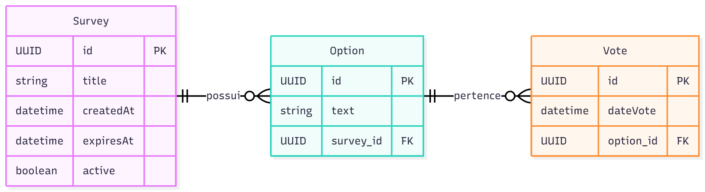

# Polling and Voting API

## Tema do Projeto e Justificativa

O projeto "Polling and Voting" é uma API REST desenvolvida em Java com Spring Boot para gerenciar enquetes (pesquisas), opções de voto e votos de usuários. O objetivo é fornecer uma solução simples e robusta para criação, votação e apuração de resultados de enquetes online, facilitando a integração com sistemas web e mobile. A justificativa para o projeto é a necessidade recorrente de sistemas de votação em ambientes acadêmicos, eventos, pesquisas de opinião e decisões rápidas em grupos, onde a transparência e a facilidade de uso são essenciais.

## Diagrama das Entidades e Relacionamentos



## Lista de Endpoints

- **Surveys**
  - `GET /api/v1/surveys` — Listar todas as pesquisas
  - `GET /api/v1/surveys/{id}` — Detalhar uma pesquisa (com opções)
  - `POST /api/v1/surveys` — Criar uma nova pesquisa
  - `PUT /api/v1/surveys/{id}` — Atualizar uma pesquisa
  - `DELETE /api/v1/surveys/{id}` — Remover uma pesquisa
  - `GET /api/v1/surveys/{id}/results` — Resultado da pesquisa

- **Options**
  - `POST /api/v1/surveys/{surveyId}/options` — Adicionar opção à pesquisa
  - `DELETE /api/v1/options/{id}` — Remover opção

- **Votes**
  - `POST /api/v1/vote` — Registrar voto

## Como rodar e buildar o projeto

Para rodar tudo (aplicação + banco) usando Docker:

```sh
docker-compose up --build
```

A aplicação estará disponível em http://localhost:8080 e o banco em localhost:5432.

Para rodar apenas local (sem Docker), suba o banco com `docker-compose up -d postgres` e rode a aplicação normalmente pelo Maven ou sua IDE.